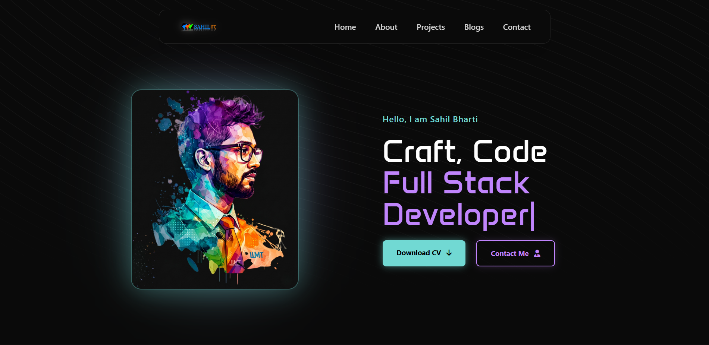
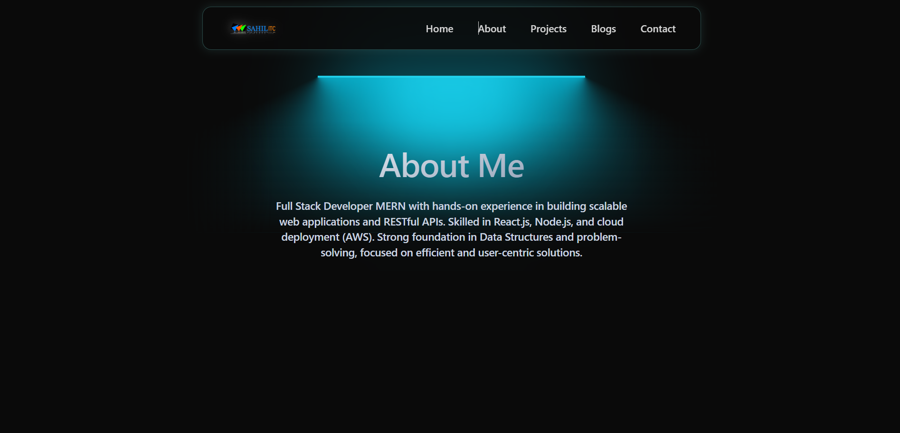
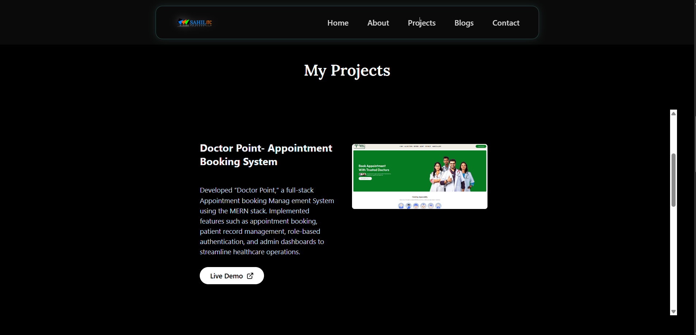
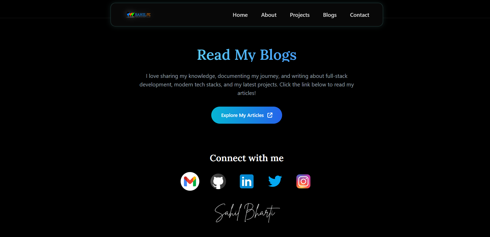

<div align="center">
  
</div>

<h1 align="center">✨ Personal Developer Portfolio ✨</h1>

<div align="center">
  <strong>A modern, responsive, and interactive portfolio website built to showcase my projects, skills, and experience.</strong>
</div>

<br />

<div align="center">
  <a href="https://my-portfolio-lac-alpha-39.vercel.app/">
    
  </a>
</div>

<br />

<div align="center">
  
  
  
  
</div>

---

## 🚀 Features

- **Modern UI/UX**: Designed with a sleek, clean, and professional aesthetic.
- **Fully Responsive**: Adapts seamlessly to all devices (desktop, tablet, mobile).
- **Interactive Animations**: Smooth scroll and component transitions powered by Framer Motion.
- **Dynamic Routing**: Single Page Application (SPA) navigation using React Router.
- **Projects Showcase**: Interactive project cards with live and GitHub links.
- **Custom Theming**: Tailwind CSS configured for a cohesive design system.

## 📸 Screenshots

Here is a glimpse of the portfolio interface:

### Home Section


### About Me


### Projects Portfolio


### Blogs & Articles


## 🛠️ Tech Stack

**Frontend Framework**
- React.js (v18)
- Vite (Build Tool)

**Styling & UI**
- Tailwind CSS
- clsx & tailwind-merge (Utility classes management)

**Animations**
- Framer Motion

**Routing**
- React Router DOM
- React Router Hash Link

**Icons**
- FontAwesome

## 💻 Getting Started

Follow these steps to run the project locally on your machine.

### Prerequisites
- Node.js (v14 or higher)
- npm or yarn

### Installation

1. **Clone the repository**
   ```bash
   git clone <repository-url>
   cd portfolio
   ```

2. **Install dependencies**
   ```bash
   npm install
   ```

3. **Start the development server**
   ```bash
   npm run dev
   ```

4. **Open your browser**
   Navigate to `http://localhost:5173` to view the application.

## 📂 Folder Structure

```text
📁 portfolio
├── 📁 public           # Static assets
├── 📁 screenshort      # Project screenshots
├── 📁 src              # Source code
│   ├── 📁 components   # Reusable UI components
│   │   ├── 📁 common   # Header, Footer, etc.
│   │   └── 📁 sections # Home, About, Projects, etc.
│   ├── App.jsx         # Main application component
│   ├── index.css       # Global styles (Tailwind imports)
│   └── main.jsx        # Application entry point
├── package.json        # Project metadata and dependencies
├── tailwind.config.js  # Tailwind CSS configuration
└── vite.config.js      # Vite configuration
```

## 🤝 Contributing

Contributions, issues, and feature requests are welcome! Feel free to check the issues page.

## 📜 License

This project is open source and available under the [MIT License](LICENSE).
